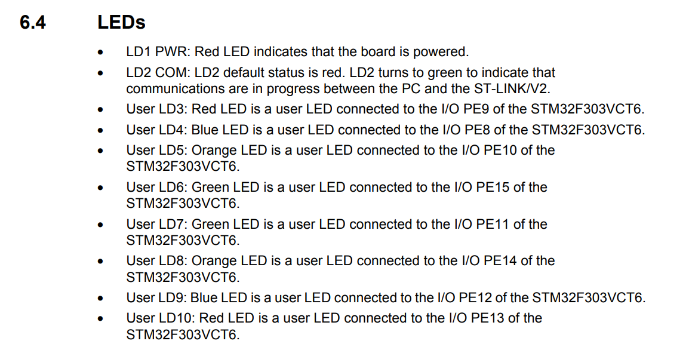

# Manual Leds STM32 f3

---
## To drive LEDs on the STM32F3 Discovery board, you have to perform two distinct steps because of how the hardware is physically designed.

Here is why both are necessary:

### 1. Enabling `rcc.ahbenr` (The "Master Power" Switch)
By default, almost all peripherals on an STM32 are **disconnected from the clock** to save power.
*   **The Problem:** If a peripheral (like `GPIOE`) doesn't have a clock signal, its internal logic is frozen. You cannot read from its registers, and any values you try to write to them will be ignored.
*   **The Solution:** The `RCC` (Reset and Clock Control) unit manages these clocks. By setting the `iopeen` bit in the `AHBENR` register, you are "turning on the power" to Port E so that it can start processing commands.
*   **Analogy:** This is like plugging a lamp into the wall outlet. Even if the lamp is "on," it won't work if there's no electricity coming from the wall.

### 2. Configuring `gpioe.moder` (The "Function" Selection)
A single GPIO pin can do many different things: it can be a digital input (like a button), a digital output (like an LED), an analog input (for sensors), or an "alternate function" (like Serial or I2C communication).
*   **The Problem:** By default, pins are usually set to **Input** mode (to prevent them from accidentally pushing voltage into something they shouldn't). In Input mode, the pin just "listens" and cannot provide the power needed to light up an LED.
*   **The Solution:** The `MODER` (Mode Register) allows you to define the behavior of each pin. By setting a pin to **Output** mode, you are telling the hardware: "I want to be able to manually drive this pin High (3.3V) or Low (0V)."
*   **Analogy:** This is like setting the switch on the lamp itself. Now that it has power (from the RCC step), you are switching it to the "Output" setting so light actually comes out.

### Summary of the Flow
1.  **RCC (ahbenr):** Connects the clock to the GPIO bank so the registers "wake up."
2.  **GPIO (moder):** Configures specific pins (8 through 15) to act as outputs.
3.  **GPIO (odr):** Sets the actual voltage (High/Low) to turn the LEDs on or off.

If you skip **Step 1**, your code in **Step 2 and 3** will have no effect because the GPIO hardware isn't "listening" yet.

---
## To find which pins control the LEDs for the "compass" on the STM32F3 Discovery board, you can look at the \*\*schematics\*\* or the board's \*\*User Manual\*\*.

### 1\. The Pin Mapping
The compass LEDs are all connected to \*\*GPIO Port E\*\*. The specific pins are:  
\* \*\*North:\*\* PE9 (Red)  
\* \*\*North-East:\*\* PE10 (Orange)  
\* \*\*East:\*\* PE11 (Yellow)  
\* \*\*South-East:\*\* PE12 (Green)  
\* \*\*South:\*\* PE13 (Red)  
\* \*\*South-West:\*\* PE14 (Orange)  
\* \*\*West:\*\* PE15 (Yellow)  
\* \*\*North-West:\*\* PE8 (Green)

\### 2. How to set them in \`moder\`  
Since the LEDs are on pins \*\*8 through 15\*\*, you need to set all of those pins to \`output()\` in the \`moder\` register.

In your code, you currently only have pin 8 set:  
\`\`\`rust  
gpioe.moder.modify(|\_, w| {  
    w.moder8().output() // Only pin 8 is configured as output  
});  
\`\`\`

To turn on the whole compass, you should update it to include all pins from 8 to 15:  
\`\`\`rust  
gpioe.moder.modify(|\_, w| {  
    w.moder8().output();  
    w.moder9().output();  
    w.moder10().output();  
    w.moder11().output();  
    w.moder12().output();  
    w.moder13().output();  
    w.moder14().output();  
    w.moder15().output()  
});  
\`\`\`

\### 3. Summary of LED Bits

| LED Color | Compass Direction | Pin | Register bit |
| :--- | :--- | :--- | :--- |
| Green | NW  | PE8 | moder8 / odr8 |
| Red | N   | PE9 | moder9 / odr9 |
| Orange | NE  | PE10 | moder10 / odr10 |
| Yellow | E   | PE11 | moder11 / odr11 |
| Green | SE  | PE12 | moder12 / odr12 |
| Red | S   | PE13 | moder13 / odr13 |
| Orange | SW  | PE14 | moder14 / odr14 |
| Yellow | W   | PE15 | moder15 / odr15 |

If you only set \`moder8().output()\`, only the \*\*North-West (Green)\*\* LED will actually light up when you write to the \`odr\` register, even if you set all bits in \`odr\`. The other pins will remain in "Input" mode and won't drive any current to the LEDs.