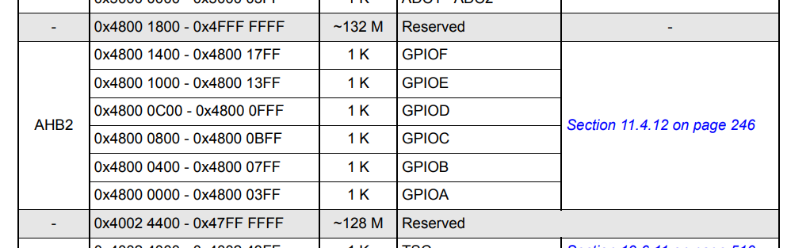
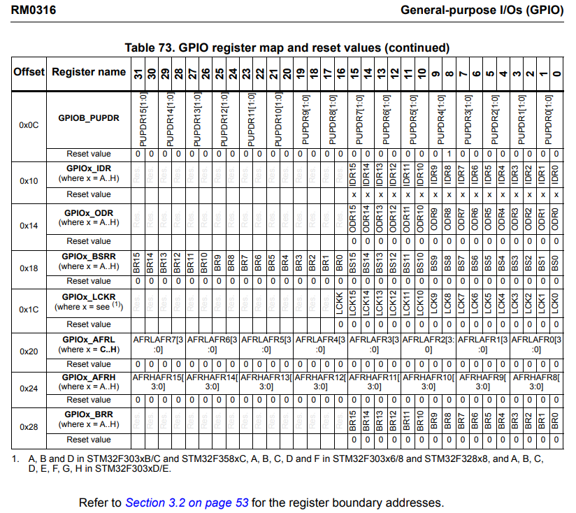
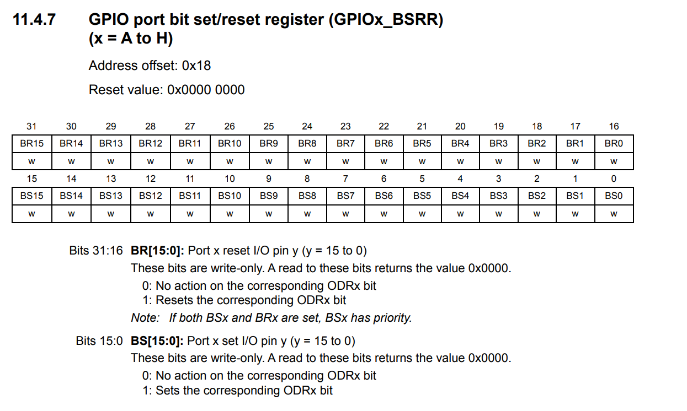
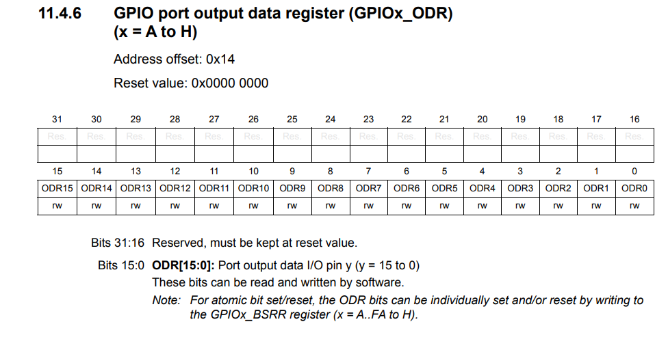
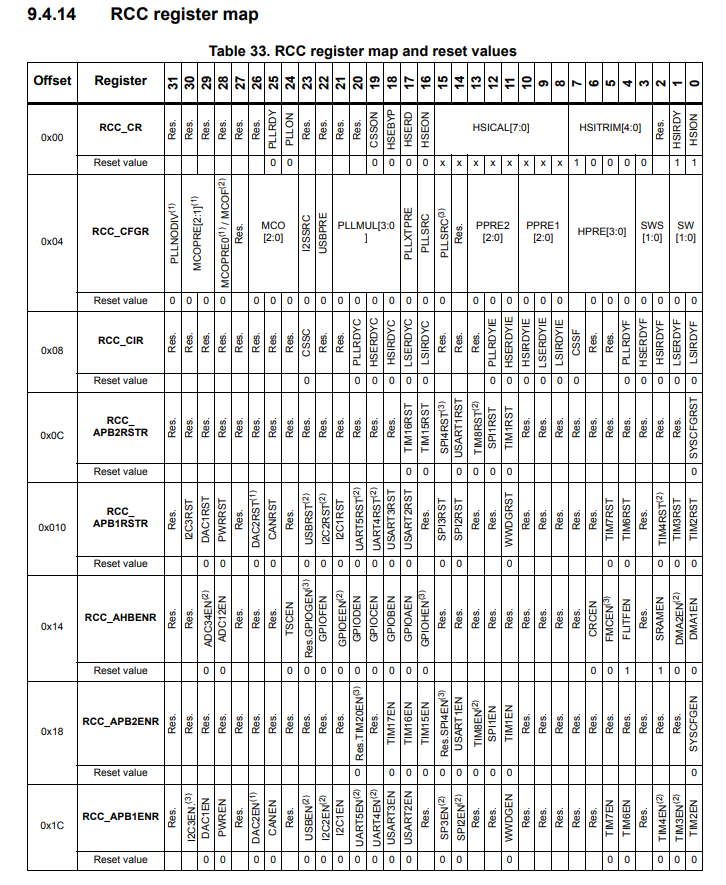

GPIOx_address :  

GPIO offset map:  

GPIOx_BSRR bit port:  

GPIO ODR :  

GPIO RCC Register map :  

Section 6.4 LEDs of the *User Manual* (page 19)):

Section 22 Timers - Page 690 - Reference Manual

Section 22.4.9 TIM6/TIM7 register map - Page 690 - Reference Manual

- SR, the status register.
- EGR, the event generation register.
- CNT, the counter register.
- PSC, the prescaler register.
- ARR, the autoreload register.

  